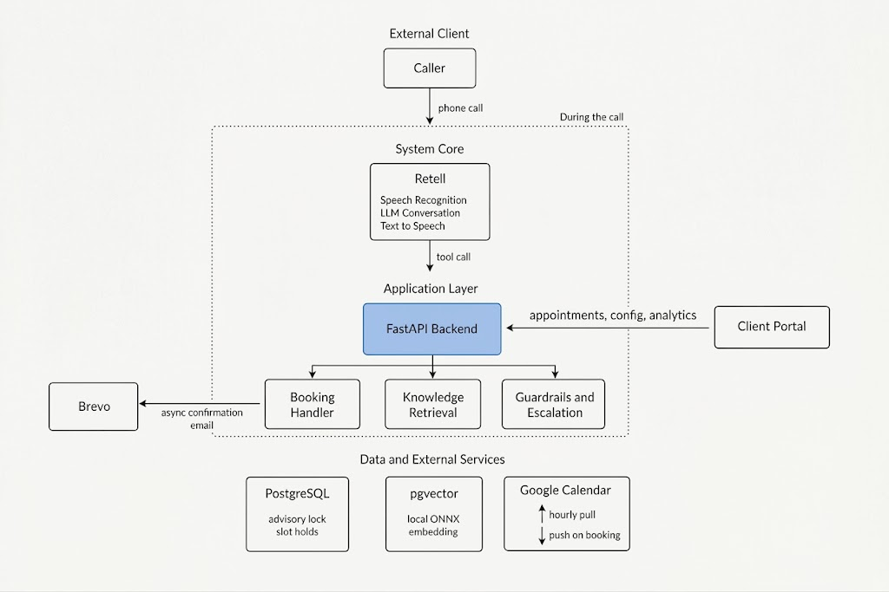
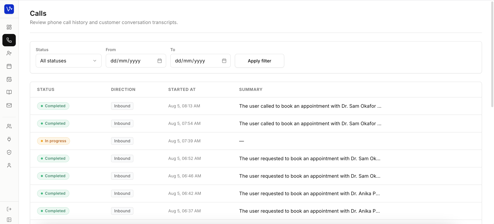
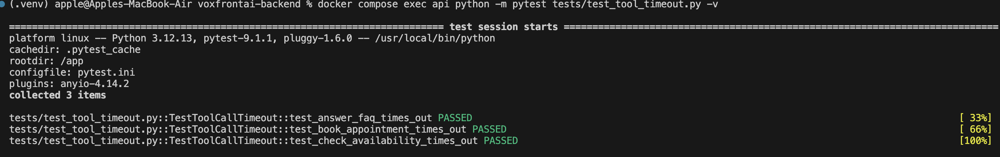
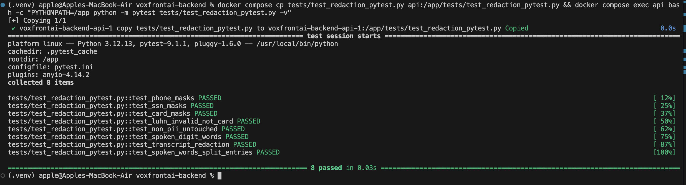
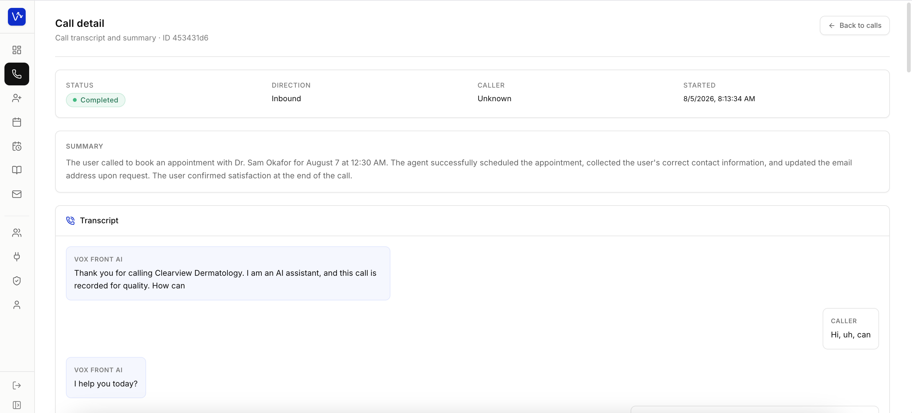

# Vox Front — Engineering an AI Voice Agent for Appointment Booking

**How I handled booking conflicts, delays during live calls, and rules that
should not be left to the LLM.**

https://www.voxfrontai.com

Appointment-based businesses — dentists, law firms, salons — take most of
their bookings over the phone, and the staff who would answer are usually
busy with the person already in front of them. When a call goes unanswered,
it's a booking lost. Vox Front is an AI phone receptionist that answers
those calls and books, reschedules, and cancels appointments in the
business's real calendar.

That means the backend has to handle concurrent callers competing for the
same slot, slow dependencies on a live call, external calendar state that
can change between check and booking, and actions where deterministic rules
matter more than LLM judgment.

## 1. How Vox Front Works

When a caller rings, Retell handles the conversation: speech recognition,
LLM response, and voice back to the caller. Behind that, the backend handles
the logic: which slots exist, whether a booking can be made, and whether an
escalation rule is triggered.

That logic runs in a FastAPI application I built. It handles:

- Appointment availability, booking, rescheduling, and cancellation
- Knowledge retrieval from each business's uploaded documents
- Guardrails and escalation
- Call records and per-business configuration

Each business accesses its own portal to view analytics, manage appointments,
and update its configuration. PostgreSQL stores the schedules, configurations,
and document knowledge base.

## 2. The Engineering Problems I Had to Solve

### Making Appointment Booking Safe

Booking a slot through a voice agent creates a window between the moment
availability is checked and the moment a booking is confirmed. Two callers
making concurrent requests can both see the same slot as available. A
simple availability check before inserting an appointment is not enough.

I handle it in two stages: a hold when the slot is offered, and a lock
when it is confirmed.

- **Hold on offer.** When the agent speaks a slot, the backend immediately
  creates a ten-minute hold on it. Other availability requests treat active
  holds as unavailable.

- **Lock on confirm.** When a caller confirms, the booking runs under a
  PostgreSQL advisory lock scoped to that business. Inside that lock, the
  backend checks three things before creating the appointment: existing
  appointments, active holds belonging to other callers, and busy periods
  imported from Google Calendar. If the slot is gone, the caller receives
  fresh alternatives.

**Testing surfaced an edge case:** a dropped call gives the caller a new
call ID, so their own hold could appear as another caller's and block the
slot they were just offered. I tied holds to the caller's phone number as
well as the call ID. A redial from the same number recovers its held slots,
while another caller still sees those holds as unavailable.

The concurrency test runs two booking requests against the same slot
simultaneously and confirms exactly one appointment is created. Separate
tests cover the redial case and expired holds. No double-bookings have
been observed in production.

_Booking concurrency test: 12/12 checks pass, including the same-slot race, redial recovery by caller phone, and expired-hold reuse. Run against a real PostgreSQL instance._

### Making Live Calls More Reliable

A slow operation on a live call is not a performance issue. It is a
functional failure. I audited everything that executes while a caller is
on the line.

- **External embedding dependency.** FAQ retrieval depended on a hosted
  embedding API for every query. This added a network round trip on every
  lookup and created a hard failure if the API was unavailable. I moved
  embedding in-process using a local ONNX model. FAQ retrieval now
  completes reliably regardless of external API status.

- **Blocking email.** Confirmation email used synchronous SMTP inside the
  async application, blocking the event loop on every confirmation sent
  during a live call. I replaced it with Brevo's HTTP API through an async
  client, removing that blocking I/O from the event loop entirely.

- **Unbounded tool calls.** Scheduling and FAQ calls had no upper time
  bound. A hanging operation would leave the caller waiting indefinitely.
  I added an eight-second timeout that returns a fixed spoken fallback when
  an operation overruns. Tests deliberately hang these operations and
  verify the fallback path is taken.

_Tool-call timeout test: each scheduling and FAQ tool call is forced to hang and the 8-second fallback path is verified (3/3)._

### Making AI Behavior More Predictable

Not every behavior should be left to the model. Disclosure, escalation,
and data handling are enforced in application code, not prompted.

- **Guaranteed disclosure.** The opening disclosure is sent as a fixed
  message before the LLM takes the call, configured per business. It
  cannot be skipped or varied.

- **Grounded answers.** FAQ retrieval is scoped to the current client and
  returns up to three chunks above a similarity threshold. Below it, the
  agent returns a fixed fallback rather than pulling unrelated context or
  generating an answer.

- **Consistent escalation.** When a caller repeatedly pushes a restricted
  topic, escalation is triggered by server-tracked state, not by the LLM
  applying the rule consistently across a conversation.

- **PII redaction before storage.** Transcripts and logged tool arguments pass through redaction covering card numbers, SSNs, phone numbers, and digit-words spoken aloud before anything is stored. Tests confirm each is stripped before storage.

_PII redaction test: 8/8 checks confirm card, SSN, phone, and digit-words spoken aloud are masked before storage._

## 3. Tradeoffs and Current Limits

- **In-process scheduling.** At a single instance, running scheduled work
  inside the FastAPI process needs no coordination overhead or additional
  infrastructure. The calculation changes with horizontal scaling. Each
  instance would run the same job independently, requiring either a dedicated
  process or explicit coordination.

- **Hourly Calendar polling.** Polling requires nothing to maintain.
  Bookings reach Calendar immediately; staff edits made directly in Calendar
  can take up to an hour to appear in availability. A requirement for fresher
  external state would push the integration to webhooks.

- **One advisory lock per business.** A per-business lock is the simplest
  solution that is provably correct at this scope. Narrowing it to staff
  member or slot adds complexity that only pays off under measurable
  contention. That contention does not exist at current call volume.
